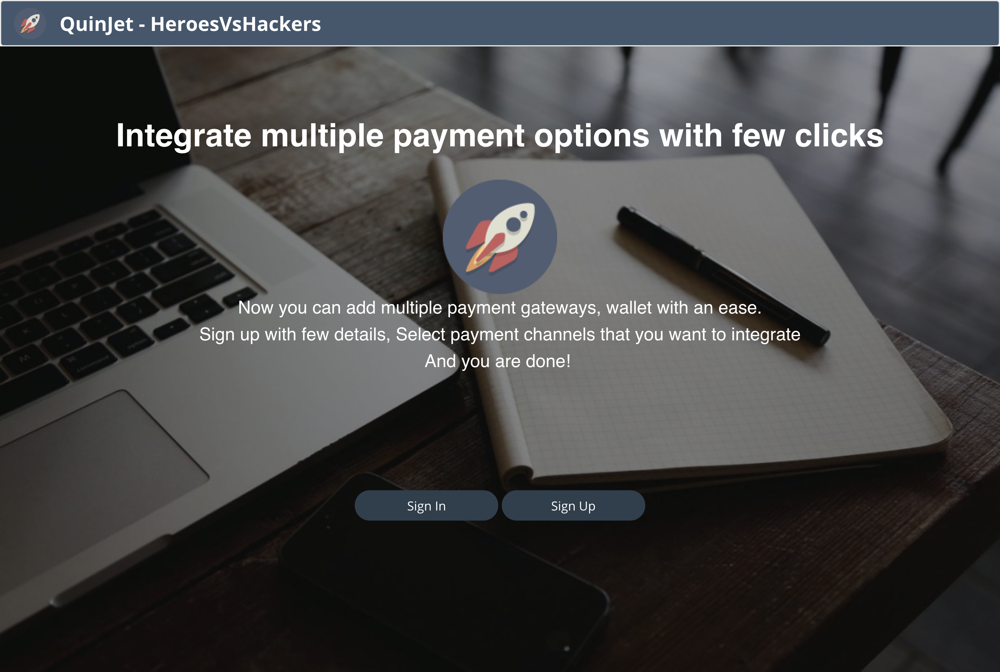

# Mjolnir
An easy way to add multiple payment options on your website!

_This project was the part of 36-hour hackathon organized by Rise in partnership with Barclays._

## Problem Statement:

The World of Merchants has declared a state of confusion. Merchants continue to be bombarded with different payment options for their mobile applications.

For merchants to accept payments, there are the following problems:
* It is time consuming and costly to integrate different payment APIs.
* Merchants lack the necessary technical resources to integrate APIs.
* It detracts merchants away from their focus on their customer experience.
* There is no universal UI layer for merchants to accept multiple payment options. It leads to abandoned sales as customers are forced to pay by leaving the app.
* It is time consuming for customers to enter their payment data for each transaction.
* It is your mission to simplify the merchant payment experience.